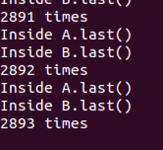

#DeadLock
###死锁截图

###四个死锁的必要条件
1.互斥使用（资源独占） 
一个资源每次只能给一个进程使用 
 
2.不可强占（不可剥夺） 
资源申请者不能强行的从资源占有者手中夺取资源，资源只能由占有者自愿释放
  
3.请求和保持（部分分配，占有申请） 
一个进程在申请新的资源的同时保持对原有资源的占有（只有这样才是动态申请，动态分配）
  
4.循环等待 
存在一个进程等待队列 
{P1 , P2 , … , Pn}, 
其中P1等待P2占有的资源，P2等待P3占有的资源，…，Pn等待P1占有的资源，形成一个进程等待环路

###对上述程序产生死锁的解释
创建Deadlock函数的时候，调用了b.methodB（a）函数 也就是调用了a的last函数。过了polling时间后，调用a.methodA(b)函数，也就是调用了b的last函数。当某次b.methodB(a)想要调用a的last函数，同时a.method(b)想要调用b的last函数。由于资源互斥和不可强占的规则，A和B进入循环等待。死锁成立。