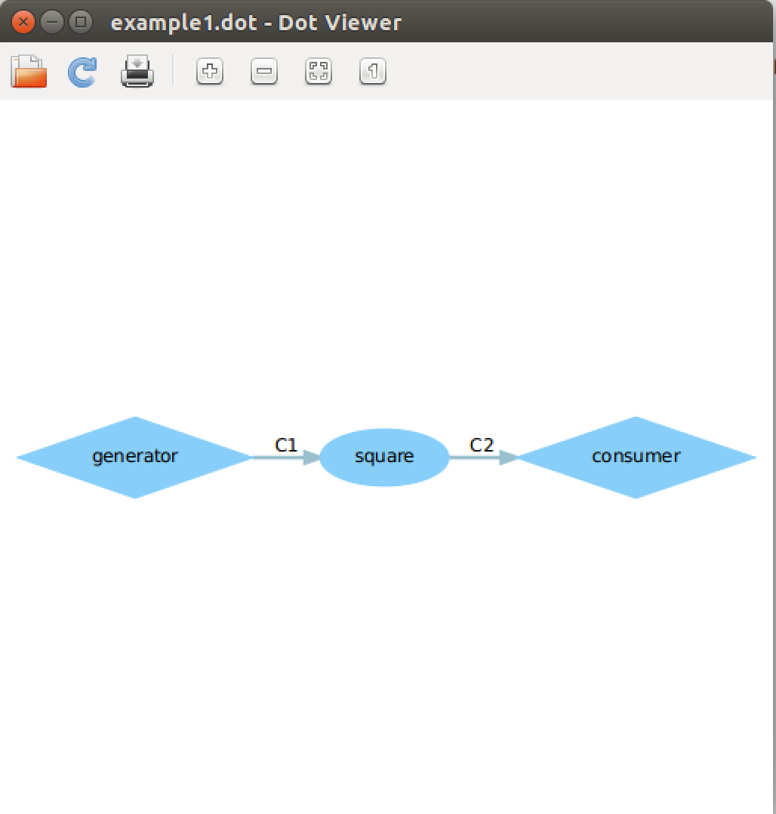
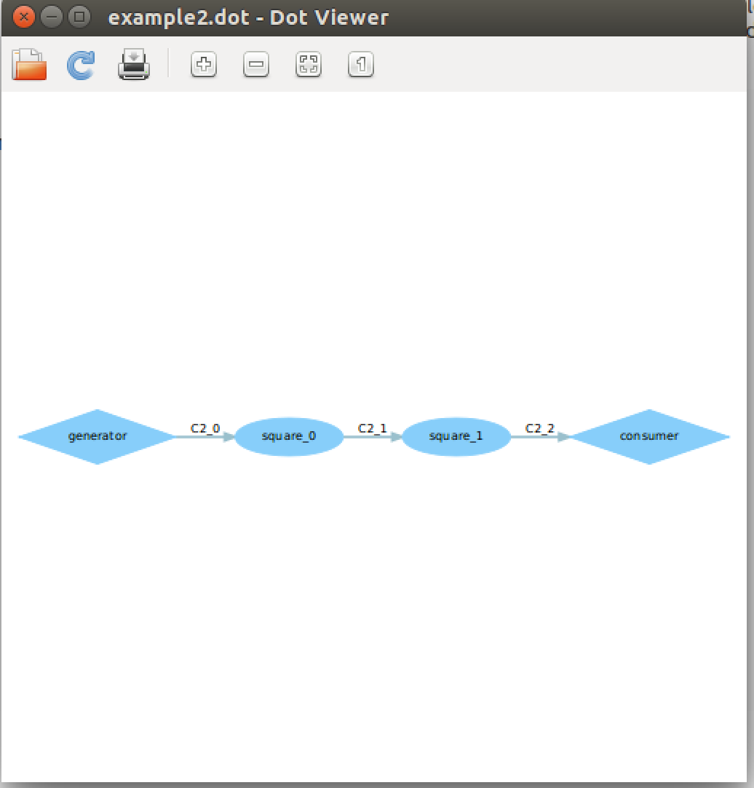
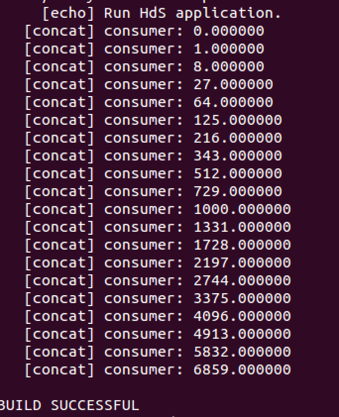
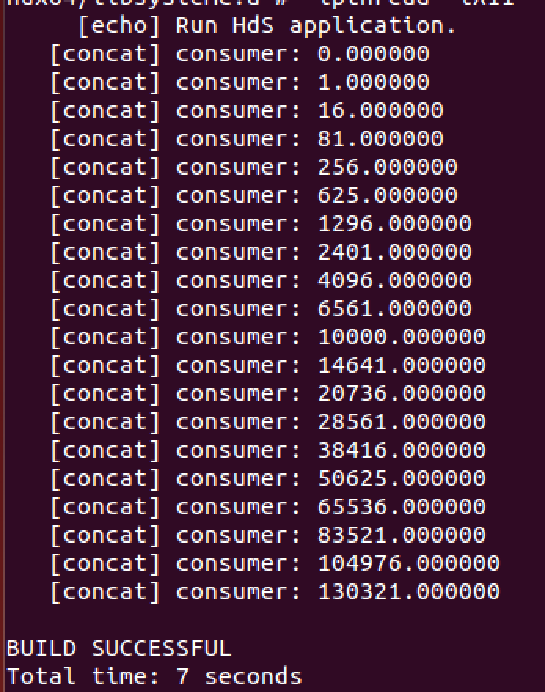

##DOL_lab3

###example1

 
###example2

 

###如何修改
  example1的修改方法为，将square.c中i= ixi 改为i = ixixi。删除开始在build中运行的example1文件重新编译运行得到；
  
   
  example2的修改方法为，将example.xml中N的值由3改为2更改iterate的次数。
  
  
   
###实验感想
实验本身比较简单，理解比较轻松，但是对markdown和虚拟机的学习还有待加强。